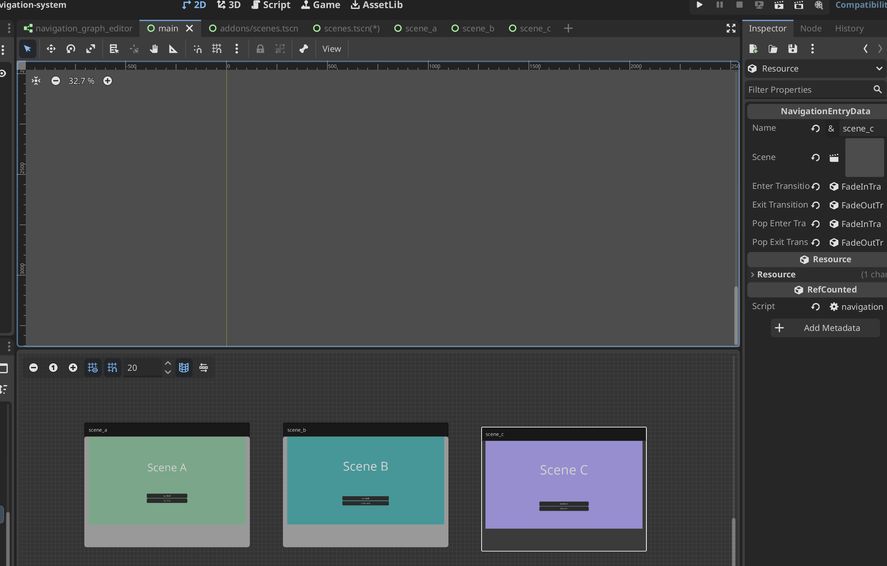

# Godot UI Navigation System

Godot GDScript Plugin for managing UI Navigation and Transitions between Control Nodes

> ⚠️ Disclaimer: This plugin is in early development stage and may not be fully functional or stable
> Any feedback, suggestions or contributions are welcome :) 

## Features
- Navigate using global `NavigationController` autoload
- `NavigationHost` component to host `NavigationGraph` resource that serves as a map of the UI and a single source of truth
- `NavigationGraph` resource allows to define UI Scenes and their transitions
- In-Engine Editor for creating and editing `NavigationGraph` resources
- Flexible `NavigationTransition` system to define transitions between UI Scenes


## Installation
1. Clone this repository into your Godot project directory and put contents of the addon folder into  your `addons` directory.
2. Enable the plugin in Godot Editor by going to `Project` -> `Project Settings` -> `Plugins` and enable the `Navigation System` plugin.


## Usage
1. Create a new `NavigationGraph` resource in your project.
2. Create a new `NavigationHost` node in your scene and assign the `NavigationGraph` resource to it.
3. When `NavigationGraph` is selected you can add and remove destination entries and specify transition using the Navigation Graph Editor.



4. Use the `NavigationController` autoload to navigate between UI Scenes using the defined transitions.

```gdscript
NavigationController.push("destination_name") # Pushes a new scene onto the navigation stack
NavigationController.pop() # Pops the current scene from the navigation stack
```


## License
This plugin is licensed under the MIT License. See the [LICENSE](LICENSE) file for more details.